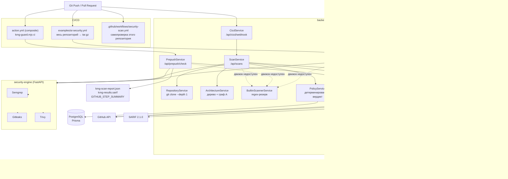

# Архитектура

Документ описывает фактический состав системы. Компоненты, которых нет в коде,
в схемы не включены; отсутствующие элементы вынесены в раздел
[Отсутствующие компоненты](#5-отсутствующие-компоненты).

Навигация: [README](README.md) · [ANALYSIS_PIPELINE](ANALYSIS_PIPELINE.md) ·
[DECISION_ENGINE](DECISION_ENGINE.md) · [SECURITY](SECURITY.md)

---

## 1. Физический состав

| Сервис | Технология | Точка входа | Порт |
|---|---|---|---|
| `backend` | NestJS 12, TypeScript, ESM | [backend/src/main.ts](../backend/src/main.ts) | 3000 |
| `security-engine` | FastAPI, Python 3.11 | [security-engine/app/main.py](../security-engine/app/main.py) | 8000 |
| `frontend` | React 19 + Vite, nginx | [frontend/src/main.tsx](../frontend/src/main.tsx) | 5173 → 80 |
| `postgres` | PostgreSQL 16-alpine | — | 5432 |
| CI-компоненты | GitHub Actions + Node.js 18+ | [action.yml](../action.yml), [tools/git-hooks/kmg-guard.mjs](../tools/git-hooks/kmg-guard.mjs) | — |

Оркестрация — [docker-compose.yml](../docker-compose.yml). `backend` и
`security-engine` делят том `kmg-workspaces`, смонтированный в
`/tmp/kmg_workspaces`: backend материализует туда рабочую область, а
security-engine читает её по тому же пути.

---

## 2. Схема компонентов



---

## 3. Компоненты

### 3.1. Модуль интеграции с CI/CD

Реализован тремя независимыми путями. Все три существуют в коде.

#### 3.1.1. Composite GitHub Action

* **Файл:** [action.yml](../action.yml)
* **Назначение:** запуск проверки отдельным шагом пайплайна и возврат кода завершения.
* **Вход:** `api-url`, `token`, `block-on`, `fail-open`, `paths`, `max-files`, `upload-sarif`.
* **Выход:** `verdict`, `critical`, `report`, `sarif`; файлы `kmg-scan-report.json`, `kmg-results.sarif`.
* **Технологии:** GitHub composite action + Node.js.
* **Взаимодействие:** выполняет `kmg-guard.mjs ci`, затем `github/codeql-action/upload-sarif@v3`.
* **Ошибки:** недоступный API или отсутствующий токен → `exit 1`, если `fail-open` не равен `true`.
* **ИБ:** токен передаётся через `inputs.token` в переменную окружения `KMG_TOKEN`; в лог не пишется.

#### 3.1.2. Готовый workflow «под ключ»

* **Файл:** [examples/ai-security.yml](../examples/ai-security.yml)
* **Назначение:** проверка репозитория целиком без установки чего-либо.
* **Вход:** секреты `KMG_API_URL`, `KMG_TOKEN`.
* **Выход:** `results.sarif` (артефакт + Code Scanning), job summary, комментарий в PR.
* **Технологии:** `tar` + `curl`.
* **Взаимодействие:** `POST /api/ci/scan` с телом `application/gzip`; вердикт читается из заголовков `X-KMG-*`.
* **Ошибки:** HTTP ≠ 200 → `exit 1`; пустые секреты → `exit 1`.
* **ИБ:** архив собирается с исключением `node_modules`, `.git`, бинарных файлов.

#### 3.1.3. Guard (общий для CI и git-хуков)

* **Файл:** [tools/git-hooks/kmg-guard.mjs](../tools/git-hooks/kmg-guard.mjs) (701 строка)
* **Назначение:** единый код отбора файлов, вызова API и печати результата для
  режимов `pre-commit`, `pre-push` и `ci`.
* **Вход:** режим (`ci` / `pre-push` / `pre-commit`), конфигурация из переменных
  окружения, `git config kmg.*` или `.kmg.json`.
* **Выход:** код завершения, `kmg-scan-report.json`, `kmg-results.sarif`,
  `GITHUB_STEP_SUMMARY`, `GITHUB_OUTPUT`.
* **Взаимодействие:** `POST {apiUrl}/prepush/check`.
* **Ошибки:** в режиме `ci` сбой проверки → `exit 1` (fail-closed); локально → `exit 0` (advisory).
* **ИБ:** enforcement-логика вынесена в экспортируемые функции
  `enforcementMode`, `shouldFailProcess`, `shouldFailOnScanError` и покрыта тестами.

#### 3.1.4. Самопроверка репозитория агента

* **Файл:** [.github/workflows/security-scan.yml](../.github/workflows/security-scan.yml)
* **Назначение:** сборка, тесты и прогон движка по собственному коду.
* **Особенность:** содержит два независимых гейта — шаг `Enforce KMG AI security
  policy` (через `action.yml`) и шаг `Check local engine results` (проверка
  `scan_results.json` на незавершённые сканеры и CRITICAL-находки).

### 3.2. Сбор кода на анализ

Три способа получить рабочую область. Все реализованы.

| Способ | Файл | Что попадает в анализ |
|---|---|---|
| Распаковка архива из CI | [ci.service.ts](../backend/src/ci/ci.service.ts) | весь репозиторий, как его упаковал workflow |
| Материализация git-блобов | [prepush.service.ts](../backend/src/prepush/prepush.service.ts) | файлы, переданные guard-ом (по умолчанию — изменённые) |
| Клонирование из GitHub | [repository.service.ts](../backend/src/repository/repository.service.ts) | весь репозиторий, `git clone --depth 1` |

* **Выход:** каталог рабочей области + количество файлов + commit SHA + ветка.
* **Ошибки:** пустая рабочая область — жёсткая ошибка, а не «0 находок»
  (`ci.service.ts` бросает `BadRequestException`, `scan.service.ts` ставит статус
  `FAILED`, `main.py` возвращает HTTP 422).
* **ИБ:** содержимое архива проверяется до записи на диск
  ([tar-inspector.ts](../backend/src/ci/tar-inspector.ts)); пути из pre-push
  payload нормализуются и отклоняются при попытке выхода за пределы рабочей
  области (`PrepushService.safeRelativePath`). Рабочая область удаляется в блоке
  `finally`.

### 3.3. Построение контекста проекта

* **Файл:** [architecture.service.ts](../backend/src/scan/architecture.service.ts)
* **Назначение:** дерево файлов, подсчёт строк, определение языков по расширению,
  граф архитектуры (Graph A) — модули, контроллеры, сервисы, модели, БД, внешние API.
* **Вход:** путь рабочей области.
* **Выход:** `{ nodes, edges, fileTree, filesCount, linesCount, languages }`.
* **Ограничения:** обход останавливается на **800 файлах**
  ([architecture.service.ts:182](../backend/src/scan/architecture.service.ts#L182)); файлы
  крупнее 250 КБ не разбираются, крупнее 500 КБ не считаются по строкам.
* **ИБ:** `readFileContent` блокирует path traversal и прогоняет содержимое через
  `redactSecrets` перед отдачей в UI.
* **Важно:** это **не** индекс для отбора файлов под конкретное требование ИБ.
  Граф используется в интерфейсе, а не для планирования анализа — см.
  [CONTEXT_ANALYSIS.md](CONTEXT_ANALYSIS.md).

### 3.4. Статический анализ (security-engine)

* **Файл:** [security-engine/app/main.py](../security-engine/app/main.py)
* **Вход:** `{ repository_path, scan_id, scanners? }`.
* **Выход:** `{ status, duration_ms, filesCount, scanners{}, findings[] }`.
* **Технологии:** FastAPI, `asyncio.gather` — три сканера выполняются параллельно.
* **Контракт статусов:** `COMPLETED` присваивается только когда инструмент
  действительно отработал и выдал разбираемый отчёт. Исключённый политикой
  сканер получает `SKIPPED`, а не `COMPLETED` с нулём находок.
* **Ошибки:** каждый сканер возвращает `FAILED` с текстом причины; упавшая
  корутина перехватывается через `return_exceptions=True` и тоже становится `FAILED`.
* **ИБ:** все три сканера запускаются через `asyncio.create_subprocess_exec`
  (массив аргументов, без оболочки).

Подробности по каждому сканеру — [ANALYSIS_PIPELINE.md](ANALYSIS_PIPELINE.md#static-analysis).

### 3.5. Встроенный резервный сканер

* **Файл:** [builtin-scanner.service.ts](../backend/src/scan/builtin-scanner.service.ts)
* **Назначение:** дать разработчику хоть какой-то результат, когда
  security-engine недоступен. 15 регулярных правил (секреты, `eval`, SQL-инъекция,
  command injection, SSRF, XSS, path traversal, слабый хеш, CORS `*`).
* **Вход/выход:** путь рабочей области → массив находок с `scanner: "builtin_fallback"`.
* **Ключевое свойство:** резерв **не** засчитывается как выполнение требуемого
  сканера. Политика по-прежнему видит `semgrep/gitleaks/trivy = FAILED` и
  возвращает `SCAN_PARTIAL`, то есть вердикт `PASS` невозможен.
* **ИБ:** значения найденных секретов заменяются на `***REDACTED***`.

### 3.6. Слой языковой модели

* **Файл:** [groq.service.ts](../backend/src/ai/groq.service.ts)
* **Провайдер:** Groq (`https://api.groq.com/openai/v1/chat/completions`).
* **Модель по умолчанию:** `openai/gpt-oss-120b`, переопределяется `GROQ_MODEL`.
* **Особенности:** пул ключей с состояниями `unknown/healthy/cooldown/invalid`,
  автоматический перебор при 401/403/429, учёт заголовка `Retry-After`.
* **Ошибки:** возвращается `{ ok: false, error }`; ключи в сообщениях и логах
  не фигурируют — только порядковый номер `key #N`.

Потребители модели:

| Потребитель | Файл | Что делает |
|---|---|---|
| `SecurityControlsService` | [security-controls.service.ts](../backend/src/agent/security-controls.service.ts) | оценивает 10 контролей ИБ пачками по 3 |
| `InvestigationService` | [investigation.service.ts](../backend/src/agent/investigation.service.ts) | триаж находок, цепочки атак, итоговая сводка |
| `GroqService.explainFinding` | [groq.service.ts](../backend/src/ai/groq.service.ts) | объяснение одной находки по запросу из UI |
| `AgentService.recon` | [agent.service.ts](../backend/src/agent/agent.service.ts) | необязательный осмотр репозитория, выключен по умолчанию (`AI_RECON_ENABLED=false`) |

Подробности — [LLM.md](LLM.md).

### 3.7. Валидация доказательств

Реализована частично; ниже — то, что есть в коде.

| Где | Механизм | Файл |
|---|---|---|
| Оценка контролей ИБ | Ответ модели сопоставляется с картой реально найденных признаков `filePath:line`; всё, чего нет в карте, отбрасывается. При пустом результате подставляются фактические признаки. | [security-controls.service.ts](../backend/src/agent/security-controls.service.ts) (`toAssessment`) |
| Контроли без признаков | Не отправляются в модель вообще — статус `MISSING` выставляется детерминированно. | `missingWithoutEvidence` |
| Цепочки атак | Связь, ссылающаяся на файл, которого нет среди находок, отбрасывается; тип ребра приводится к белому списку. | [investigation.service.ts](../backend/src/agent/investigation.service.ts) (`buildAttackPaths`) |
| Цепочки после триажа | Рёбра, опирающиеся на находки, признанные ложными, удаляются. | `dropPathsForFalsePositives` |
| Триаж находок | Принимаются только вердикты с `id` из текущего батча. **Утверждения модели о файлах и строках внутри текста вердикта не проверяются** — TODO. | `triageBatch` |

### 3.8. Модуль формирования отчёта

* **Файл:** [sarif.service.ts](../backend/src/scan/sarif.service.ts)
* **Выход:** SARIF 2.1.0 — находки сканеров плюс контроли ИБ со статусом
  `MISSING`/`PARTIAL`, у которых есть подтверждающий `filePath`.
* **Особенности:** `partialFingerprints` для устойчивого сопоставления находок
  между прогонами; `versionControlProvenance` с commit SHA и веткой; ограничение
  5000 результатов; `buildEncoded` сжимает gzip + base64 для Code Scanning API.
* **Дополнительно:** `kmg-guard.mjs` собирает свой минимальный SARIF локально
  (`toSarif`), чтобы CI не ходил за отчётом вторым запросом.

Форматы — [REPORT_FORMAT.md](REPORT_FORMAT.md).

### 3.9. Модуль принятия решения

* **Файл:** [policy.service.ts](../backend/src/policy/policy.service.ts)
* **Вход:** находки, статусы сканеров, состояние рабочей области, пороги из БД.
* **Выход:** `{ riskScore, result, isBlocked, isReview, isPass, isIncomplete, statusText, reasons }`.
* **Свойство:** полностью детерминированный. Ответ модели на вход не поступает.
* **Пороги:** хранятся в таблице `policies` и редактируются из интерфейса
  (`blockOnCritical`, `blockRiskScore`, `reviewRiskScore`, `reviewHighCount`,
  набор включённых сканеров, флаг `aiAnalysis`).

Подробности — [DECISION_ENGINE.md](DECISION_ENGINE.md).

### 3.10. Хранение артефактов

| Артефакт | Где хранится |
|---|---|
| Находки, сканы, контроли, граф, AI-анализы | PostgreSQL, схема [backend/prisma/schema.prisma](../backend/prisma/schema.prisma) |
| `scan_results.json` (самопроверка) | артефакт сборки `security-scan-results` |
| `kmg-scan-report.json`, `kmg-results.sarif` | рабочий каталог job-а; выгружаются через `upload-sarif` |
| `results.sarif` (workflow «под ключ») | артефакт `kmg-security-report` + Code Scanning |
| Job summary (Markdown) | `GITHUB_STEP_SUMMARY` |
| Рабочая область | `/tmp/kmg_workspaces`, удаляется в `finally` после скана |

---

## 4. Хранилище данных

Ключевые сущности [schema.prisma](../backend/prisma/schema.prisma):

```
Scan ─┬─ Finding ──── AIAnalysis (type: finding_triage)
      ├─ SecurityControl   (10 контролей, unique по scanId+control)
      ├─ GraphNode / GraphEdge / AttackPath
      ├─ AIAnalysis        (repository_recon | finding_analysis | scanner_summary)
      └─ ScanResult        (счётчики, riskScore, policyResult, summary: JSON-строка)
```

`Scan.policyResult` — nullable (`PASS|REVIEW|BLOCK|null`). При незавершённой
проверке там остаётся `null`, тогда как `ScanResult.policyResult` — `NOT NULL` и
принудительно получает `REVIEW`: авторитетным является поле на `Scan`.

Отдельной сущности для требований ИБ-01…ИБ-08 в схеме нет.

---

## 5. Отсутствующие компоненты

Перечислены компоненты из задания, которых в коде нет.

| Компонент | Состояние | Что потребуется |
|---|---|---|
| Requirement engine (ИБ-01…ИБ-08) | NOT IMPLEMENTED | Реестр восьми требований, детерминированный сбор релевантных файлов по каждому, статус `PASS`/`VIOLATION`/`INSUFFICIENT_EVIDENCE`, включение статусов в отчёт и политику |
| Индекс проекта под требование | NOT IMPLEMENTED | Классификация файлов, скоринг релевантности, карта символов; сейчас есть только граф архитектуры для UI |
| Генератор Markdown-отчёта | NOT IMPLEMENTED | Рендер `Scan` + `Finding` + `SecurityControl` в `report.md` и сохранение артефактом |
| Сводная часть отчёта по п. 4.6.3 ТЗ | NOT IMPLEMENTED | Поля `commit_id`, `started_at`, `finished_at`, `duration_seconds`, статус по каждому требованию |
| Код завершения 2 | NOT IMPLEMENTED | Отделить «проверка не выполнена» от «проверка выполнена и заблокировала» в `kmg-guard.mjs` |
| Дедупликация находок между сканерами | NOT IMPLEMENTED | Сейчас одна проблема, найденная Semgrep и Trivy, даёт две записи `Finding`; единого `finding_id` с полем `detected_by` нет |
| Корректное завершение по лимиту 30 минут | NOT IMPLEMENTED | Есть `timeout-minutes: 30` на уровне job-а, но агент не формирует частичный отчёт при исчерпании времени |
