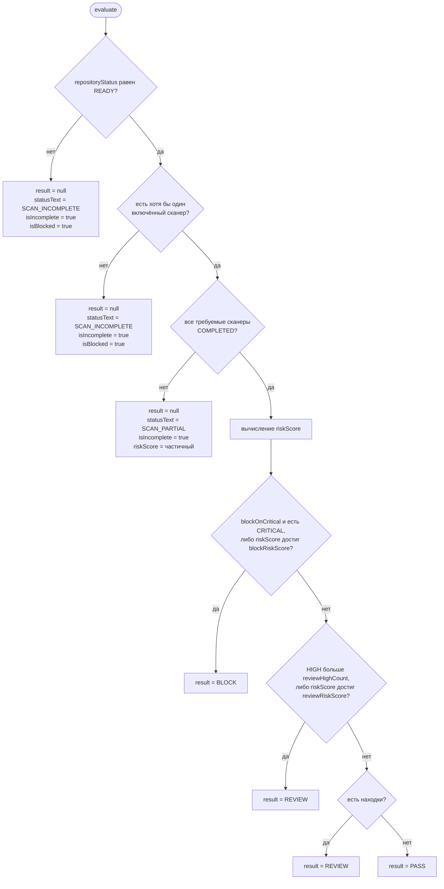

# Механизм принятия решения

Навигация: [README](README.md) · [CI_CD](CI_CD.md) ·
[SECURITY_REQUIREMENTS](SECURITY_REQUIREMENTS.md) · [LLM](LLM.md)

Реализация: [backend/src/policy/policy.service.ts](../backend/src/policy/policy.service.ts)
и [tools/git-hooks/kmg-guard.mjs](../tools/git-hooks/kmg-guard.mjs).

---

## Ключевое свойство

**Языковая модель не возвращает код завершения и не участвует в вычислении
вердикта.**

Это проверяется по сигнатуре входа политики:

```ts
export interface PolicyEvaluationInput {
  findings: Finding[];                              // из таблицы findings
  scanners: Record<string, ScannerStatusRecord>;    // статусы инструментов
  repositoryStatus: 'READY' | 'FAILED' | 'INCOMPLETE';
  hasConfirmedAttackPaths?: boolean;                // сейчас всегда false
  requiredScanners?: string[];                      // из настроек политики
  thresholds?: PolicyThresholds;                    // из таблицы policies
}
```

Ни одного поля, происходящего от модели, здесь нет. Результаты триажа, статусы
контролей ИБ и итоговая сводка хранятся отдельно и на решение не влияют.

Фактическая схема:

```
Находки сканеров        ─┐
Статусы сканеров        ─┤
Состояние рабочей области├──► PolicyService.evaluate() ──► вердикт
Пороги политики из БД   ─┘           (детерминированный)      │
                                                              ▼
                                            shouldFailProcess() ──► exit code
```

Параметр `hasConfirmedAttackPaths` предусмотрен в интерфейсе, но во всех трёх
местах вызова (`ScanService`, `CiService`, `PrepushService`) передаётся `false`
либо не передаётся вовсе. То есть граф атак, построенный моделью, на оценку
риска сейчас не влияет.

---

## Алгоритм



### Шаг 1 — состояние рабочей области

Если `repositoryStatus !== 'READY'`, возвращается `SCAN_INCOMPLETE`,
`result = null`, `isBlocked = true`. Клонирование не удалось, архив не
распаковался, файлов нет — вердикт не выносится.

### Шаг 2 — наличие включённых сканеров

Если все три сканера отключены в политике, вердикт также не выносится: проверять
соответствие нечем.

### Шаг 3 — завершённость требуемых сканеров

Каждый сканер из `requiredScanners` должен иметь статус `COMPLETED`. Иначе —
`SCAN_PARTIAL`, `result = null`, `isIncomplete = true`. Частичная оценка риска
по уже найденным находкам сохраняется в `riskScore`, но вердикт остаётся пустым.

Принцип сформулирован в комментарии к
[.github/workflows/security-scan.yml](../.github/workflows/security-scan.yml):
«"we could not check" is not "there is nothing to find"».

Обратите внимание: `isBlocked` в этой ветке равен `false`, а `isIncomplete` —
`true`. Обе ветки приводят к ненулевому коду завершения в CI, потому что
`shouldFailProcess` проверяет `incomplete` отдельно от `blocked`.

### Шаг 4 — расчёт оценки риска

```
score = Σ ( вес(severity) × коэффициент(confidence) )

вес:           CRITICAL 10.0   HIGH 6.0   MEDIUM 3.0   LOW 1.0   INFO 0.2
коэффициент:   HIGH 1.0        MEDIUM 0.8             LOW 0.6

если hasConfirmedAttackPaths → score × 1.25     (сейчас не активируется)

riskScore = min( round(score × 10) / 10 , 10.0 )
```

Расчёт полностью детерминирован: одинаковый набор находок всегда даёт одинаковую
оценку. Потолок 10.0 означает, что при большом числе находок оценка перестаёт
различать проекты — это учтено в [LIMITATIONS.md](LIMITATIONS.md).

### Шаг 5 — вердикт

Пороги берутся из таблицы `policies`, строка `default`. Значения по умолчанию
(`DEFAULT_POLICY`):

| Параметр | Значение | Смысл |
|---|---|---|
| `blockOnCritical` | `true` | любая находка `CRITICAL` → `BLOCK` |
| `blockRiskScore` | `7.0` | оценка риска ≥ 7.0 → `BLOCK` |
| `reviewRiskScore` | `3.5` | оценка риска ≥ 3.5 → `REVIEW` |
| `reviewHighCount` | `1` | более одной находки `HIGH` → `REVIEW` |
| `scanners` | все включены | какие сканеры обязательны |
| `aiAnalysis` | `true` | выполнять ли AI-этап |

Порядок проверок:

```
1. blockOnCritical && CRITICAL > 0   →  BLOCK
   ИЛИ riskScore >= blockRiskScore   →  BLOCK
2. HIGH > reviewHighCount            →  REVIEW
   ИЛИ riskScore >= reviewRiskScore  →  REVIEW
3. findings.length > 0               →  REVIEW
4. иначе                             →  PASS
```

Значение `PASS` выдаётся **только** при нуле находок и при всех завершённых
сканерах. Любая, даже одна находка уровня `INFO`, даёт `REVIEW`.

Ввод, поступающий из интерфейса, нормализуется (`normalize`): числа
ограничиваются диапазоном 0–10, нечисловые значения заменяются значениями по
умолчанию, булевы приводятся к типу. Политикой нельзя задать порог, отключающий
проверку завершённости сканеров.

---

## Преобразование вердикта в код завершения

Выполняет [kmg-guard.mjs](../tools/git-hooks/kmg-guard.mjs):

```js
export function enforcementMode(mode) {
  return mode === 'ci' ? 'enforce' : 'advisory';
}

export function shouldFailProcess(result, config, mode) {
  if (enforcementMode(mode) !== 'enforce') return false;
  return Boolean(
    result?.incomplete ||
    hasFailedScanner(result) ||
    shouldBlock(result, config)
  );
}

export function shouldFailOnScanError(config, mode) {
  return enforcementMode(mode) === 'enforce' && !config.failOpen;
}
```

`shouldBlock` учитывает две вещи: явный порог `KMG_BLOCK_ON`, делающий CI строже
серверной политики, и собственно вердикт сервера (`result.blocked` либо
`result.verdict === 'BLOCK'`).

| Состояние | Локально | В CI |
|---|---|---|
| `PASS` | 0 | 0 |
| `REVIEW` | 0 | 0 |
| `BLOCK` | 0 | 1 |
| `SCAN_PARTIAL` / `SCAN_INCOMPLETE` | 0 | 1 |
| Сканер `FAILED` | 0 | 1 |
| Проверку не удалось выполнить | 0 | 1 при `failOpen = false`, иначе 0 |

---

## Категории результатов

### Что реализовано

| Категория | Влияние на решение |
|---|---|
| Находка `CRITICAL` | `BLOCK` при `blockOnCritical` |
| Находка `HIGH` | `REVIEW` при превышении `reviewHighCount`; `BLOCK`, если суммарная оценка достигла `blockRiskScore` |
| Находка `MEDIUM` / `LOW` / `INFO` | `REVIEW`; `BLOCK` только через накопленную оценку риска |
| Незавершённый сканер | вердикт не выносится, в CI — код 1 |
| Неготовая рабочая область | вердикт не выносится, в CI — код 1 |
| Вердикт модели `TRUE_POSITIVE` / `FALSE_POSITIVE` | **не влияет** |
| Статус контроля ИБ `MISSING` | **не влияет** на вердикт; попадает в SARIF как `warning` |
| Связь графа атак | **не влияет** (`hasConfirmedAttackPaths` всегда `false`) |

### Что отсутствует

| Категория из ТЗ | Состояние |
|---|---|
| Нарушения обязательных требований ИБ-01…ИБ-08 | **NOT IMPLEMENTED** — требований как сущностей нет |
| Дополнительные находки, не блокирующие пайплайн | **NOT IMPLEMENTED** — разделения нет |
| Предупреждения информационного характера | PARTIAL — `REVIEW` не блокирует, но отдельной категории «warning» нет |
| Ошибки выполнения как отдельная категория | PARTIAL — обнаруживаются, но отображаются в тот же код 1 |

---

## Приоритеты

Реализованный порядок, от старшего к младшему:

```
1. Рабочая область не готова        →  вердикта нет           (в CI: код 1)
2. Нет включённых сканеров          →  вердикта нет           (в CI: код 1)
3. Требуемый сканер не завершён     →  вердикта нет           (в CI: код 1)
4. Порог KMG_BLOCK_ON превышен      →  BLOCK                  (в CI: код 1)
5. Вердикт сервера BLOCK            →  BLOCK                  (в CI: код 1)
6. REVIEW                           →  продолжение            (в CI: код 0)
7. PASS                             →  продолжение            (в CI: код 0)
```

Ключевые инварианты, закреплённые тестами:

| Инвариант | Смысл | Тест |
|---|---|---|
| `ERROR ≠ PASS` | незавершённая проверка никогда не становится `PASS` | тесты 3–7 в [scan-correctness.spec.ts](../backend/test/scan-correctness.spec.ts) |
| `BLOCK ≠ WARNING` | `BLOCK` в CI всегда даёт ненулевой код | тест 8 в [kmg-guard.test.mjs](../tools/git-hooks/kmg-guard.test.mjs) |
| `WARNING ≠ VIOLATION` | `REVIEW` не прерывает пайплайн | тест 7 там же |
| Отказ AI ≠ отказ проверки | находки сканеров сохраняются, вердикт выносится | тесты 8, 9 в `scan-correctness.spec.ts` |
| Fail-open не отменяет вердикт | `KMG_FAIL_OPEN=1` действует только на недоступную проверку | отдельный тест в `kmg-guard.test.mjs` |

Инвариант, **не** закреплённый в коде: `ERROR ≠ BLOCK`. Обе ситуации дают код 1,
и оператор CI не может отличить их по коду завершения — только по тексту в
журнале. Это и есть отсутствующий код 2, см.
[CI_CD.md](CI_CD.md#код-завершения-2).

---

## Расхождение с ТЗ

Главное архитектурное расхождение, которое следует понимать при оценке.

**ТЗ формулирует решение так:** пайплайн блокируется при наличии нарушений
обязательных требований ИБ-01…ИБ-08 (п. 4.3.3). Прочие дефекты безопасности
приводятся отдельным разделом и основанием для прерывания не являются (п. 4.8.1).

**Реализовано иначе:** пайплайн блокируется при наличии находки уровня
`CRITICAL` либо при достижении порога оценки риска — независимо от того,
относится ли находка к перечню ИБ.

Практические следствия:

| Ситуация | Требуется по ТЗ | Фактически |
|---|---|---|
| Пароль хешируется SHA-256 (нарушение ИБ-04) | `BLOCK` | Semgrep не детектирует SHA-256 как слабый хеш → находки нет → возможен `PASS` |
| Документация без ссылок на нормативную базу (нарушение ИБ-06) | `BLOCK` | `.md` не читается → находки нет → `PASS` |
| Журналирование покрывает часть обработчиков (нарушение ИБ-07) | `BLOCK` | контроль может дать `PARTIAL`, но на вердикт это не влияет → `PASS` |
| Уязвимость `CRITICAL` в зависимости, не связанная с перечнем ИБ | не блокирует | `BLOCK` |
| SQL-инъекция, не отнесённая ни к одному требованию ИБ | не блокирует (п. 4.8.1) | `BLOCK` |

То есть механизм и **пропускает** нарушения обязательных требований, и
**блокирует** по основаниям, которые ТЗ блокирующими не считает.

### Что требуется изменить

1. Ввести сущность требования со статусом `PASS` / `VIOLATION` /
   `INSUFFICIENT_EVIDENCE` (см.
   [SECURITY_REQUIREMENTS.md](SECURITY_REQUIREMENTS.md)).
2. Расширить `PolicyEvaluationInput` полем `requirements`.
3. Изменить правило блокировки: `BLOCK` при наличии хотя бы одного требования со
   статусом `VIOLATION`.
4. Вынести прочие находки в отдельную категорию, не влияющую на вердикт; оценку
   риска сохранить как справочную характеристику.
5. Определить политику для `INSUFFICIENT_EVIDENCE`: настраиваемо — `REVIEW` либо
   `BLOCK`; `PASS` недопустим.
6. Сохранить действующие инварианты завершённости сканеров: незавершённая
   проверка по-прежнему не должна давать `PASS`.
